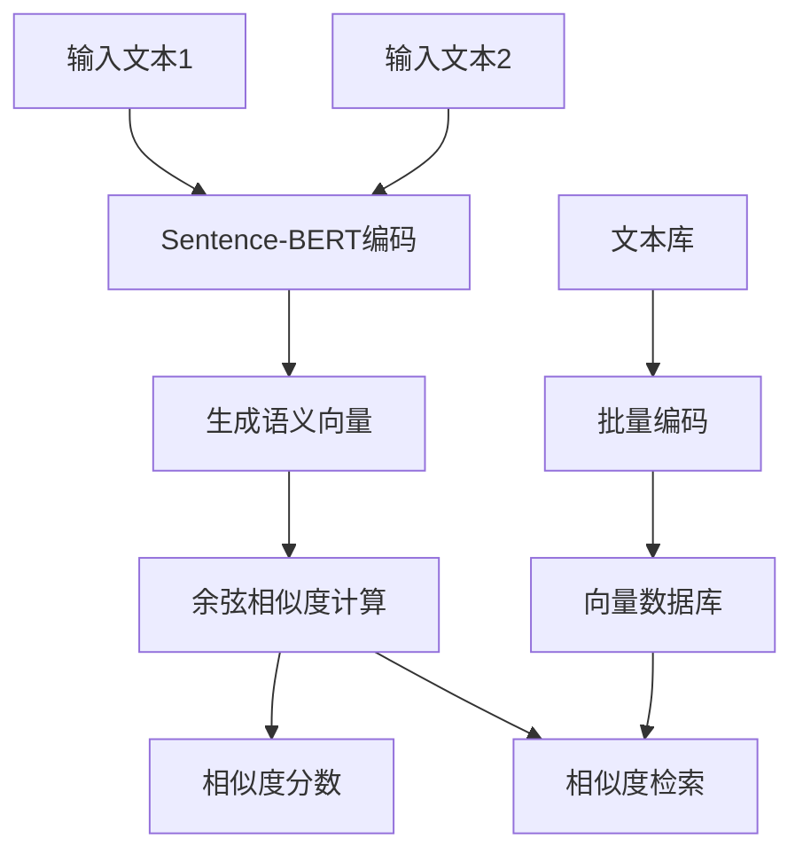

# 基于Sentence-BERT的文本编码与相似度计算技术方案

## 一、整体流程


## 二、技术方案详解

### 1. Sentence-BERT原理
- **孪生网络架构**：两个BERT共享权重，同时编码两个句子
- **池化策略**：对BERT输出进行均值/最大池化，得到固定长度向量
- **对比学习**：使用NLI等数据集微调，使相似句子向量空间距离更近

### 2. 编码实现
```python
from sentence_transformers import SentenceTransformer

# 加载预训练模型（如all-MiniLM-L6-v2）
model = SentenceTransformer('paraphrase-multilingual-MiniLM-L12-v2')

# 文本编码
sentences = ["这是第一句话", "这是第二句话"]
embeddings = model.encode(sentences, convert_to_tensor=True)
```

### 3. 相似度计算方法

| 方法           | 公式                        | 特点                 |
| -------------- | --------------------------- | -------------------- |
| **余弦相似度** | cos(θ) = (A·B)/(\|A\|\|B\|) | 最常用，忽略长度影响 |
| **欧氏距离**   | d = \|A-B\|                 | 关注绝对距离         |
| **曼哈顿距离** | d = Σ\|A_i-B_i\|            | 鲁棒性较好           |

### 4. 大规模检索方案
```python
# 索引构建
corpus_embeddings = model.encode(corpus, convert_to_tensor=True)

# 相似度检索（支持批量）
from sentence_transformers.util import semantic_search
hits = semantic_search(query_embedding, corpus_embeddings, top_k=5)
```

### 5. 优化策略
- **模型选择**：根据语言、速度需求选择合适的SBERT模型
- **批量编码**：提升GPU利用率
- **向量量化**：压缩存储空间，提升检索速度
- **混合精度**：FP16推理加速

### 6. 应用场景
- **语义搜索**：基于语义相似度的文档检索
- **文本聚类**：生成向量后进行聚类分析
- **重复检测**：识别相似或重复文本
- **推荐系统**：基于内容相似度的推荐

Sentence-BERT相比原生BERT，在保证语义表示质量的同时，显著提升了相似度计算的效率和准确性，向量维度更低（384-768维），更适合工业级应用。